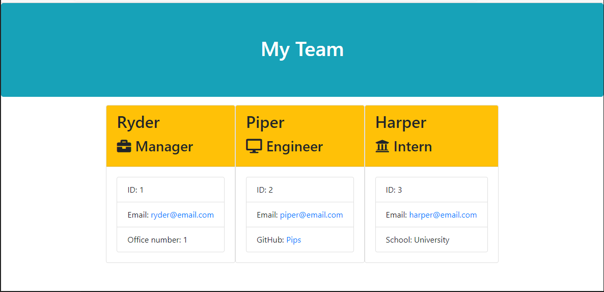

# Team_Profile_Generator

A Node.js command line application that takes in information about employees on a software engineering team and generates a HTML webpage

Screenshot of a ReadMe file that is created

Link for Demo
https://github.com/Burch531/Team_Profile_Generator/issues/1#issue-873495221
Link for Test
https://github.com/Burch531/Team_Profile_Generator/issues/2#issue-873497509